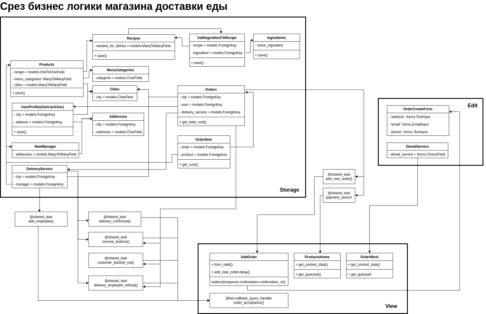
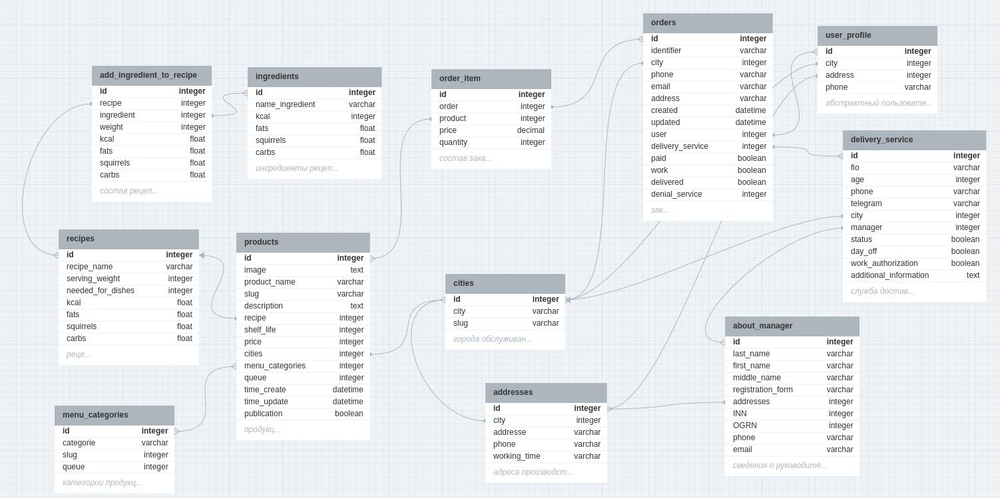

# Интернет-магазин для деятельности ресторанов, услуги по доставке продуктов питания.
### Технология: Django Nginx Celery Redis Gunicorn Docker-Compose TeleBot Certbot

#### Данный проект был разработан с целью автоматизации процесса заказа продуктов питания до потребителя. В процессе, были использованы следующие инструменты:
Django - фреймворк разработки веб-приложений на языке Python.

Nginx - web-сервер, который широко применяется в обслуживании статического и динамического контента.

Celery+Redis — обеспечивают обработку задач в фоновом режиме: добавление нового ордера, отслеживание его статуса.

Gunicorn - запуска и управления web-приложения.

TeleBot - использовался для создания бота взаимодействия с полевыми сотрудниками через Telegram.

Каждый из перечисленных выше инструментов запущен и настроен в контейнере Docker. В процессе запуске магазина на сервере, добавлена возможность сознания SSL сертификата через Certbot с последующим его автоматическим обновлением.
Присутствует панель управления отслеживания новых заказов и их отправки до заказчика оператором + страница зала производства продукции. 

В завершении вступления и перед началом описания инструкции процесса установки магазина на сервер, нельзя не сказать  
о последней опции и это система приема платежей Yookassa. С её помощью вы будете безопасно принимать платежи, настроить чеки для налоговой и многое другое что значительно облегчит ведение вашего бизнеса. 

# Запуск магазина на сервере.
#### Для дальнейшей работы уже должно быть приобретено доменное имя, зарегистрирован аккаунт в Юкасса - для начала можно использовать тестовый магазин, Dadata - подсказки при вводе адреса и email клиентом, получен токен Telegram бота. Облачный сервер например VDS by selectel - где все и будет происходить далее.
## Прошу учесть, что на данный момент основное внимание при разработке уделялось бэкенду и магазин практически не оптимизирован под работу с мобильными устройствами. Это учебный проект и с большей долей вероятности возможны баги. Если вы решите использовать этот материал в коммерческой деятельности, то делаете это на свой страх и риск.

### Минимальная конфигурация сервера:
- Ubuntu 22.04 64bit
- 1 ГБ RAM
- 30 ГБ SSD
- 1 CPU
#### После того как IP, логин и пароль от сервера получены, подключаемся по ssh. И первым делом обновляемся, при выполнении команд на все запросы системы отвечаем утвердительно:
- sudo apt update
- sudo apt upgrade
#### Вторым действием которое необходимо выполнить, это установка движка Docker Engine:
Последовательно запускаем команды:
- sudo apt-get install ca-certificates curl
- sudo install -m 0755 -d /etc/apt/keyrings
- sudo curl -fsSL [https://download.docker.com/linux/ubuntu/gpg]("") -o /etc/apt/keyrings/docker.asc
- sudo chmod a+r /etc/apt/keyrings/docker.asc

Вставляем строчку в командную строку целиком и выполняем:

      echo \
      "deb [arch=$(dpkg --print-architecture) signed-by=/etc/apt/keyrings/docker.asc] https://download.docker.com/linux/ubuntu \
      $(. /etc/os-release && echo "$VERSION_CODENAME") stable" | \
      sudo tee /etc/apt/sources.list.d/docker.list > /dev/null

- sudo apt-get update
- sudo apt-get install docker-ce docker-ce-cli containerd.io docker-buildx-plugin docker-compose-plugin
- sudo apt install docker-compose

#### Далее необходимо установить GIT:
- sudo apt install git 
#### Создаем папку в которую будет клонирован проект:  
- mkdir /var/www
- cd /var/www
#### Клонируем проект в папку www:
git clone [https://github.com/anwind-git/food_delivery_service.git]("")
#### Перемещаемся в нее: 
- cd food_delivery_service

#### И здесь необходимо внести первые изменения. В файле nginx.conf вписываем свой домен: 
- nano nginx.conf

Находим строчку и вместо 120.0.0.1 вписываем имя домена:

    server_name 120.0.0.1;
#### Углубляемся внутрь корневой папки проекта shipping_service и создаем необходимые директории кэширования, логирования, статических файлов и получения сертификата SSL: 
- cd shipping_service
- mkdir -m 777 log cache static
- mkdir certbot
- mkdir certbot/conf
- mkdir certbot/www
- mkdir certbot/conf/live/
#### Отредактируем файл с токенами. Там храниться все ключи которые получали от юкасса, dadata, telebota и секретный ключ самого проекта. После знака = вписываем только то что было скопировано, без кавычек: 
- nano .env

DEBUG=False

SECRET_KEY=<секретный ключ проекта django>

TOKEN_BOT=<API token телеграм>

ACCOUNT_YOOKASSA=<ID аккаунта магазина юкаса>

SECRET_KEY_YOOKASSA=<Секретный ключ юкасса>

TOKEN_ID_DADATA=<API-ключ>

SECRET_DADATA=<Секретный ключ>

#### Отредактируем конфигурационный файл settings:
- cd shipping_service
- nano settings.py 

      ALLOWED_HOSTS = ['Ваш домен']

#### Переместимся из корневой папки в самое начало food_delivery_service и запустим процесс создания контейнеров Docker:
- cd ../..
- sudo docker-compose up -d --build

Если все было сделано правильно, процесс создания пройдет без ошибок.
#### Выполняем три команды: миграции, перенос статики и создание суперпользователя:
Мигрируем поля моделей данных проекта в базу данных Postgres: 
- sudo docker-compose run --rm web-app sh -c "python manage.py makemigrations"
- sudo docker-compose run --rm web-app sh -c "python manage.py migrate"

Объединяем статику в одну папку. В процессе на вопрос системы отвечаем Yes:
- sudo docker-compose run --rm web-app sh -c "python manage.py collectstatic"

Добавляем суперпользователя, запоминаем логин и пароль, подними мы будем заходить в панель управления администратора: 
- sudo docker-compose run --rm web-app sh -c "python manage.py createsuperuser"

Все команды должны пройти без ошибок.
#### Перезапускаем build
- sudo docker-compose up -d --build
#### И наконец запускаем проект:
- sudo docker-compose up -

Теперь, если в браузере перейти на домен магазина можно наблюдать 503 ошибку и это хорошо, это значит что все системы работаю и необходимо выполнить последние шаги настройки. 

#### Оставляем пока в покое окно терминала в котором работали и открываем еще одно, снова подключаемся к серверу по ssh:
Перемещаемся в:
- cd /var/www/food_delivery_service

Вписываем свои email и домен, выполняем в командной строке:
 
docker-compose run --rm --entrypoint "\
certbot certonly --webroot -w /var/www/certbot \
  --email exempl@mail.ru \
  -d exempl.ru \
  --rsa-key-size 2048 \
  --agree-tos \
  --force-renewal" certbot

На вопрос certbot отвечаем Yes

Если все прошло без ошибок это значит что сертификат SSL получен:

Закрываем окно терминала, где получили сертификат. Возвращаемся в терминал где был запущен магазин и останавливаем его работу
выполнив нажатие клавиш клавиатуры ctrl + c. Есть еще один вариант остановки контейнеров docker 

- stop $(docker ps -a -q)

#### Добавляем новые настройки nginx. Сейчас вы должны находиться в директории food_delivery_service и в ней выполнить команду:
nano nginx.conf

Удаляем там все и вставляем новые настройки, незабываем снова вписать свой домен:

    worker_processes auto;
    worker_rlimit_nofile 4096;

    events {
        worker_connections 4096;
    }

    http {
        include mime.types;
        default_type application/octet-stream;

        access_log /var/log/nginx/access.log;
        error_log /var/log/nginx/error.log;

    
        server {
            listen 80;
            server_name ВАШ_ДОМЕН;
            
            location / {
                return 301 https://$host$request_uri;
            }
        }   

        server {
            listen 443 ssl;
            server_name ВАШ_ДОМЕН;

            ssl_certificate /etc/letsencrypt/live/ВАШ_ДОМЕН/fullchain.pem;
            ssl_certificate_key /etc/letsencrypt/live/ВАШ_ДОМЕН/privkey.pem;

            location /static/ {
                alias /usr/share/nginx/html/static/;
            }

            location / {
                proxy_pass http://web-app:8000;
                proxy_set_header Host $host;
                proxy_set_header X-Real-IP $remote_addr;
                proxy_set_header X-Forwarded-Proto https;
            }
        }
    }

#### Закрываем доступ Flower на 5555 порту, находим строчку и вписываем туда логин и пароль, необязательно такие же как от суперпользователя или от сервера, совсем необязательно... 
- nano docker-compose.yml

        command: celery -A celery_app.app flower --basic_auth=<придумайте логин>:<придумайте пароль>

nano models.py

#### Убираем комментарий с метода шифрования паролей пользователей, находим метод и убираем кавычки: 
- nano /shipping_service/organization/models.py

        def save(self, *args, **kwargs):
            """
            Шифруем пароль перед сохранением. Раскомментировать после добавления супер пользователя.
            """
            self.set_password(self.password)
            super().save(*args, **kwargs)

#### Включаем защиту по протоколу SSL в конфигурационном файле settings.py, находим строки и снимаем с них кавычки:
- nano /shipping_service/settings.py

        CSRF_COOKIE_SECURE = True
        CSRF_COOKIE_HTTPONLY = True
        SECURE_PROXY_SSL_HEADER = ('HTTP_X_FORWARDED_PROTO', 'https')
        SECURE_SSL_REDIRECT = True
        SESSION_COOKIE_SECURE = True

#### Билдим контейнеры
- sudo docker-compose up -d --build

И снова запускаем проект:
- sudo docker-compose up -d

На этом процесс настройки завершен!!!

Осталось только зайти в административную панель и заполнить в первую очередь города обслуживания. Первым должен быть тот город в котором осуществляется основная деятельность, после чего его никоем случае нельзя удалять, только редактировать. Почему? Будет описано позже в главе о настройках панели администратора.

Создать нового суперпользователя с электронной почтой и телефон. А тот что вы создали через консоль лучше не использовать.

# Структура модели данных

    products {
        id integer pk increments
        image text
        product_name varchar(50)
        slug varchar(50)
        description text
        recipe integer > recipes.id
        shelf_life integer
        price integer
        cities integer >* cities.id
        menu_categories integer *>* menu_categories.id
        queue integer
        time_create datetime
        time_update datetime
        publication boolean
        integer
    }
    
    menu_categories {
        id integer pk increments
        categorie varchar(20)
        slug integer(20)
        queue integer
    }
    
    ingredients {
        id integer pk increments
        name_ingredient varchar(30)
        kcal integer
        fats float
        squirrels float
        carbs float
    }
    
    recipes {
        id integer pk increments
        recipe_name varchar(50)
        serving_weight integer
        needed_for_dishes integer
        kcal float
        fats float
        squirrels float
        carbs float
        integer
    }
    
    add_ingredient_to_recipe {
        id integer pk increments
        recipe integer >* recipes.id
        ingredient integer >* ingredients.id
        weight integer
        kcal float
        fats float
        squirrels float
        carbs float
        integer
    }
    
    user_profile {
        id integer pk increments
        city integer
        address integer
        phone varchar(20)
    }
    
    about_manager {
        id integer pk increments
        last_name varchar(30)
        first_name varchar(30)
        middle_name varchar(30)
        registration_form varchar(50)
        addresses integer >* addresses.id
        INN integer
        OGRN integer
        phone varchar
        email varchar
    }
    
    addresses {
        id integer pk increments
        city integer >* cities.id
        addresse varchar(250)
        phone varchar(20)
        working_time varchar(16)
    }
    
    cities {
        id integer pk increments
        city varchar(70)
        slug varchar(70)
    }
    
    delivery_service {
        id integer pk increments
        fio varchar(100)
        age integer
        phone varchar(20)
        telegram varchar(100)
        city integer >* cities.id
        manager integer >* about_manager.id
        status boolean
        day_off boolean
        work_authorization boolean
        additional_information text
    }
    
    orders {
        id integer pk increments
        identifier varchar
        city integer > cities.id
        phone varchar
        email varchar
        address varchar
        created datetime
        updated datetime
        user integer >* user_profile.id
        delivery_service integer >* delivery_service.id
        paid boolean
        work boolean
        delivered boolean
        denial_service integer
    }
    
    order_item {
        id integer pk increments
        order integer >* orders.id
        product integer >* products.id
        price decimal
        quantity integer
    }

